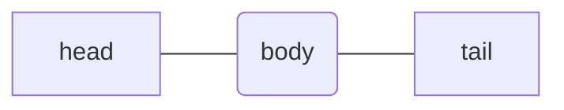
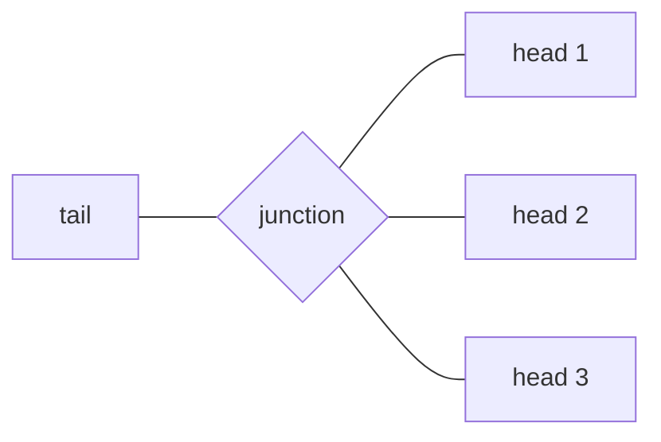

<center>

# Random Story Structure 

<div style="font-size:0.67m">  <p style="line-height:3"> Author: <i> Gergely Hornyak </p> </i> </div>

</center>

## Table of contents

- [Random Story Structure](#random-story-structure)
  - [Table of contents](#table-of-contents)
  - [Introduction](#introduction)
    - [Layout](#layout)
    - [Problem with story games](#problem-with-story-games)
    - [Problem with choice-based games](#problem-with-choice-based-games)
    - [The solution](#the-solution)
  - [Story-blocks in details](#story-blocks-in-details)
    - [The concept](#the-concept)
    - [Structure of a story-block network](#structure-of-a-story-block-network)
    - [Segments of a story-block](#segments-of-a-story-block)
  - [Network of story-blocks](#network-of-story-blocks)
    - [Branches](#branches)
  - [Story-block builder](#story-block-builder)
    - [The idea of the S-B builder](#the-idea-of-the-s-b-builder)
    - [Samples](#samples)
  - [Memory](#memory)
  - [Conclusion](#conclusion)

---

[//]: Notes-are-marked-with-brackets.

>Captions are written in this style

<div style="page-break-after: always"></div>

## Introduction

### Layout

This proposal is a theory about a concept of a random generated story based game structure to create as __realistic__ and __random__ __enviroment__ and __storyline__ for the players as possible. In the early stage it could be only available for single player games, but I don't doubt this is the limit.

In this paper I am going to outline the problems with the storylines in games nowadays, propose a model as a solution and discover the possible implementations using current technologies.

### Problem with story games

Grandiose story games such as [Skyrim](https://elderscrolls.bethesda.net/en/skyrim) or [Breath of the Wild](https://www.zelda.com/breath-of-the-wild/) require immense effort from the developers and time to create the whole masterpiece.

### Problem with choice-based games

Choice-based games such as the artworks of [Telltale](https://telltale.com/) have pseudo-choices, meaning these alternatives don't really matter. If the player chooses it won't affect their experience in such way as it was shown. The usual concept is that some moment can differ or an object may vary, which is very close to simple random-gen.

### The solution

My idea is the concept of _'story-blocks'_, which are modular blocks or pieces of a narrative. These could be linked together in a chain to create the storyline. It would need random generation for clever and realistic linking.

<div style="page-break-after: always"></div>

## Story-blocks in details

### The concept

Story-blocks are modular blocks or pieces of a narrative. The easiest way to imagine is by thinking about puzzle pieces. Not all of them fit with the others, each piece has its own place and its content. 
Each block should have an ID to act like a name and also possible to include a title (like a chapter of a book).

### Structure of a story-block network

A story-block should be built up like a [linked list](https://www.tutorialspoint.com/data_structures_algorithms/linked_list_algorithms.htm) (in CompSci), each story-block has a __head__, a __body__ and a __tail__. 



>_Illustration of a story-block_

The connection point to a previously played story is the head. It should have attributes, which could be same to other's tail attributes. If the attributes match, the story-block could be linked to the previous story-block's tail.

### Segments of a story-block

- __The head:__ contains attributes which are present at the start of the story

- __The body:__ contains smaller story-blocks called _"story-bits"_, which have the same structure but with less attributes and size. 

- __The tail:__ initially empty, will be filled with the outcomes of the story and the important variables from the head. 

The question is that does the body change based on previous story-blocks. The answer it should because the player made decisions which had impact on their journey. On the other hand, the head is responsible for flexibility, so if the current story-block was chosen it means this story is the most suitable after the previous one.

<div style="page-break-after: always"></div>

```py
class Story():
    the_story = {}

class Head():
    def __init__(self, attributes:dict):
        self.attributes = attributes

class Body():
    def __init__(self, content:Story):
        self.content = content

class StoryBlock():
    id = 0
    def __init__(self,attributes:dict,content:Story):
        self.head = Head(attributes)
        self.body = Body(content)
        self.id = StoryBlock.id
        StoryBlock.id +=1
        
    def generate_body_content(self):
        # look at attributes 
        pass
```

>A code snippet written in Python implementing a story-block

<div style="page-break-after: always"></div>

## Network of story-blocks

### Branches

In case multiple heads are suitable for a single tail a __rhombus__ or __junction__ should be formed where the player can choose between the heads.



>_An introduction of a junction_

An issue may come up, which is __how does the player choose__ from the multiple options?

The answer is a __hub__ instead of the junction, which is as seemless as possible. For example:

- a stranger offers them the possibilities
- they see multiple signs pointing different directions
- or by performing an action which has a consequence

Implementing the hub seems the most difficult at the current state due to its variety.

## Story-block builder

### The idea of the S-B builder

There must be a fabricator which assembles the blocks by the given rules. It should follow a random generated instruction set to hocus

### Samples

The story-block generator should have access to a huge set of samples to work from. These should include __names__, __places__, __times__ and other variables like coordinates. These are set by the developer __or__ obtained from the Internet via an API.
The latter one would need sources of events / scenes to analyse and build into the game. This approach seems very complicated compared to the first one.

## Memory

The game should keep track of the used or in other words _played_ story-blocks to avoid repetition. This can be carried out by saving a story-block with its variables and then after the next random generations compare them with the one in the memory.

If the new one is exactly the same or shows high resemblance then a completely new one should be produced.

<div style="page-break-after: always"></div>

## Conclusion

In theory, these story-blocks are simple and modular, following the rules of Computer Science, however in practice they are hard to implement. The basis of the difficulty comes from AI related topics. 

---


<center>

_The whole document was written using Markdown markup language._

</center>

<br><br>

<div align=right>

__last updated: 14/04/2022__ 

</div>